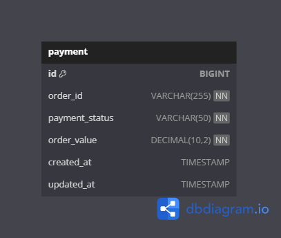
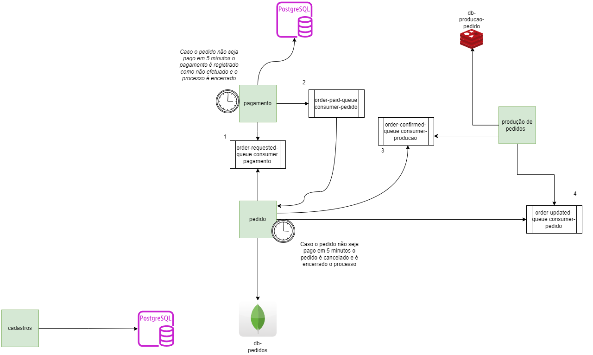
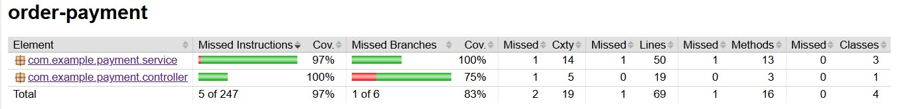

# Microsserviço de Pagamento

## 1. Objetivo do Microsserviço

O **Microsserviço de Pagamento** tem como objetivo processar e gerenciar os pagamentos de pedidos em um ambiente de microsserviços. Ele é responsável por criar, confirmar e atualizar o status dos pagamentos, garantindo a integridade das operações financeiras relacionadas aos pedidos realizados pelos clientes.

### Funcionalidades:

- Criar um novo pagamento para um pedido.
- Confirmar um pagamento pendente.
- Atualizar o status de pagamentos expirados.
- Consultar todos os pagamentos ou filtrar por status.

### Integração com outros microsserviços:

Este microsserviço se integra ao serviço de **Pedidos**. Ele recebe via fila os pedidos pendendes de pagamento e retorna eventos de confirmação de pedidos pagos para atualizar o status de pedidos pagos no serviço de pedidos.

## 2. Exposição dos Endpoints

### Endpoints disponíveis:

#### Confirmar pagamento de um pedido
```http
POST /payments/{orderId}/confirm
```
- **Descrição**: Confirma o pagamento de um pedido com o ID fornecido.
- **Retorno**: Status 200 (OK) se o pagamento for confirmado, 400 (Bad Request) em caso de erro.

#### Consultar pagamentos por status
```http
GET /payments?status={status}
```
- **Descrição**: Retorna uma lista de pagamentos filtrados pelo status fornecido (PENDENTE, CONFIRMADO, etc.).
- **Retorno**: Status 200 (OK) com a lista de pagamentos ou 400 (Bad Request) se o status for inválido.

#### Consultar todos os pagamentos
```http
GET /payments
```
- **Descrição**: Retorna uma lista com todos os pagamentos registrados no sistema.
- **Retorno**: Status 200 (OK) com a lista de pagamentos.

## 3. Banco de Dados

Abaixo está o schema utilizado no banco de dados **PostgreSQL** para armazenar as informações de pagamentos:



### Campos:
- **id**: Identificador único do pagamento.
- **order_id**: Identificador do pedido relacionado ao pagamento.
- **payment_status**: Status do pagamento (PENDENTE, CONFIRMADO, NAO_EFETUADO).
- **order_value**: Valor do pedido relacionado ao pagamento.
- **created_at**: Data e hora da criação do pagamento.
- **updated_at**: Data e hora da última atualização do pagamento.

## 4. Desenho de Solução



Fluxo do microsserviço de Pagamento:
1. O cliente faz uma requisição para confirmar um pagamento.
2. O microsserviço atualiza o status do pagamento para `CONFIRMADO`.
3. Uma mensagem é enviada via RabbitMQ para o microsserviço de pedidos.
4. O serviço de pedidos atualiza o status do pedido como pago.

## 5. Como executar o projeto localmente

### Pré-requisitos:
- **Docker**: Para rodar a aplicação e o banco de dados em containers.
- **Maven**: Para buildar o projeto.

### Passos para execução:

1. **Clonar o repositório**:
```bash
git clone <url-do-repositorio>
cd techchallenge-pagamento
```

2. **Buildar o projeto**:
```bash
mvn clean install
```

3. **Subir o ambiente com Docker Compose**:
```bash
docker-compose up --build
```

Isso iniciará o microsserviço de pagamentos, a base de dados e o RabbitMQ. O serviço estará disponível em `http://localhost:8080`.

4. **Executar os testes**:
```bash
mvn test
```
Isso rodará os testes automatizados e gerará o relatório de cobertura de testes com JaCoCo.

### Evidência de cobertura de testes




